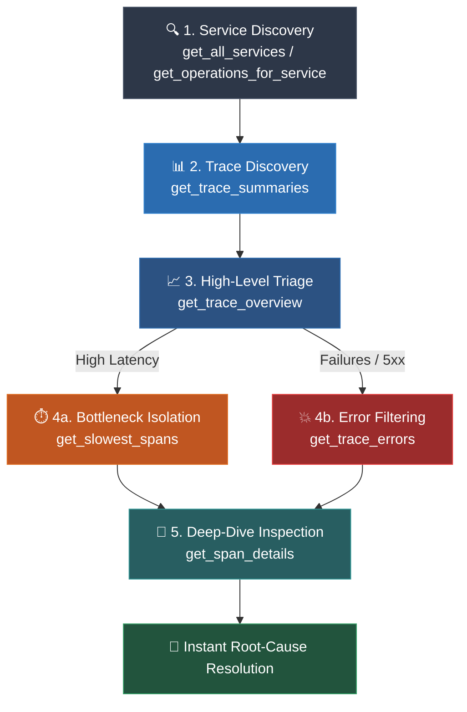

<div align="center">

# ⚡ Jaeger MCP Server

**Context-Efficient Observability & Distributed Tracing for AI Agents**

[](https://modelcontextprotocol.io/)
[](https://python.org)
[](https://github.com/modelcontextprotocol/python-sdk)
[](https://www.jaegertracing.io/)
[](LICENSE)

*Empower LLMs and AI coding assistants (Claude Desktop, Cursor, Antigravity, Cline, Windsurf) to inspect microservice topologies, triage performance bottlenecks, and pinpoint root-cause errors in distributed systems without blowing up context windows.*

---

[🚀 Quickstart](#-quickstart) •
[🎯 Why Jaeger MCP?](#-why-jaeger-mcp) •
[🛠️ Tools Reference](#️-tools-reference) •
[💡 Things You Can Do](#-things-you-can-do) •
[🔌 Client Configurations](#-client-configurations) •
[🏗️ Architecture](#️-architecture) •
[🧪 Testing & Debugging](#-testing--debugging)

---

</div>

## 🎯 Why Jaeger MCP?

Distributed traces in production systems easily contain **hundreds to thousands of spans**, deep call graphs, and megabytes of JSON tags and log events.

If an AI assistant ingests an entire raw trace:
1. 💸 **Context Window Explosion:** Traces consume tens of thousands of tokens per prompt.
2. 📉 **Hallucinations & Noise:** LLMs struggle to locate relevant errors buried beneath healthy spans.
3. 🐌 **High Latency & Costs:** Huge payloads slow down response times and skyrocket API billing.

**`jaeger-mcp` solves this with a 5-Stage Progressive Discovery Funnel:**



Instead of sending 2MB raw trace blobs, the agent queries structured, paginated, and summarized slices of observability data.

---

## 🚀 Quickstart

### Prerequisites
- **Python**: `3.11` or newer
- **Package Manager**: [`uv`](https://docs.astral.sh/uv/) (recommended) or standard `pip`
- **Jaeger Instance**: Local or remote Jaeger Query service (default port `16686`)

### 1. Clone & Set Up Environment

```bash
# Clone the repository
git clone https://github.com/your-username/jaeger-mcp.git
cd jaeger-mcp

# Create environment file from example
cp example.env .env
```

### 2. Install Dependencies

Using `uv` (fastest):
```bash
uv sync
```

Or using standard `pip`:
```bash
python -m venv .venv
# Windows (PowerShell):
.venv\Scripts\Activate.ps1
# Linux / macOS:
source .venv/bin/activate

pip install -e .
```

### 3. Spin up a Local Jaeger Demo (Optional)

Don't have a Jaeger cluster running? Launch Jaeger All-In-One with the HotROD sample microservices in Docker:

```bash
# Run Jaeger UI + Query API (Port 16686)
docker run -d --name jaeger \
  -e COLLECTOR_ZIPKIN_HOST_PORT=:9411 \
  -p 6831:6831/udp \
  -p 6832:6832/udp \
  -p 5778:5778 \
  -p 16686:16686 \
  -p 4317:4317 \
  -p 4318:4318 \
  -p 14250:14250 \
  -p 14268:14268 \
  -p 14269:14269 \
  -p 9411:9411 \
  jaegertracing/all-in-one:latest

# (Optional) Run HotROD to generate realistic distributed traffic
docker run --rm -it \
  --link jaeger \
  -p 8080:8080 \
  -e JAEGER_AGENT_HOST="jaeger" \
  -e JAEGER_AGENT_PORT="6831" \
  jaegertracing/example-hotrod:latest
```

Verify Jaeger is up by opening `http://localhost:16686` in your browser.

---

## ⚙️ Configuration & Environment

The server reads configuration from `.env` in the project root:

| Variable | Default Value | Description |
|:---|:---:|:---|
| `SERVICE_API_VERSION` | `v3` | Jaeger Query API version for services/operations/summaries (`v3` or `v2`) |

> **Note on Jaeger URL:** Each tool accepts an optional `ping_url` argument (defaults to `http://localhost:16686`). You can target local dev instances, staging clusters, or remote production Jaeger UI proxies on the fly.

---

## 🛠️ Tools Reference

`jaeger-mcp` exposes 8 production-grade MCP tools:

| Tool | Signature | Purpose |
|:---|:---|:---|
| [`ping_jaeger`](#1-ping_jaeger) | `ping_url: str` | Healthcheck Jaeger connectivity |
| [`get_all_services`](#2-get_all_services) | `ping_url: str` | List all instrumented microservices |
| [`get_operations_for_service`](#3-get_operations_for_service) | `service_name: str, ping_url: str` | List operations/endpoints & span kinds for a service |
| [`get_trace_summaries`](#4-get_trace_summaries) | `service_name, start_time_min?, start_time_max?, search_depth?, operation_name?, ping_url?` | Search recent traces with duration & span counts |
| [`get_trace_overview`](#5-get_trace_overview) | `trace_id: str, ping_url: str` | Wall-clock duration, error counts, and per-service breakdown |
| [`get_slowest_spans`](#6-get_slowest_spans) | `trace_id: str, limit?: int, offset?: int, ping_url: str` | Paginated bottleneck isolation sorted by duration descending |
| [`get_trace_errors`](#7-get_trace_errors) | `trace_id: str, ping_url: str` | Isolate failed spans, HTTP status codes, and exception logs |
| [`get_span_details`](#8-get_span_details) | `trace_id: str, span_id: str, ping_url: str` | Granular span inspect: attributes, logs/events, and child span IDs |

---

### Detailed Tool Specifications

<details>
<summary><b>1. <code>ping_jaeger</code></b> &mdash; Connection Healthcheck</summary>

Verifies that the Jaeger HTTP endpoint is reachable.

- **Parameters:**
  - `ping_url` *(optional, string)*: Base Jaeger URL (default: `"http://localhost:16686"`).
- **Returns:** Status message confirming accessibility or error diagnostics.
- **Example Response:**
  ```text
  "jaeger accessible on http://localhost:16686"
  ```
</details>

<details>
<summary><b>2. <code>get_all_services</code></b> &mdash; Service Discovery</summary>

Fetches every service registered in Jaeger's registry.

- **Parameters:**
  - `ping_url` *(optional, string)*: Jaeger URL.
- **Returns:** `GetAllServices` schema:
  ```json
  {
    "services": [
      "frontend",
      "customer-service",
      "driver-service",
      "route-service",
      "payment-gateway"
    ]
  }
  ```
</details>

<details>
<summary><b>3. <code>get_operations_for_service</code></b> &mdash; Operation Discovery</summary>

Lists all instrumented endpoints, RPCs, or internal operations for a specific microservice.

- **Parameters:**
  - `service_name` *(required, string)*: Name of the service (e.g., `"frontend"`).
  - `ping_url` *(optional, string)*: Jaeger URL.
- **Returns:** `GetServiceOperations` schema:
  ```json
  {
    "operations": [
      { "name": "HTTP GET /dispatch", "spanKind": "server" },
      { "name": "findDriver", "spanKind": "client" },
      { "name": "redis.get", "spanKind": "client" }
    ]
  }
  ```
</details>

<details>
<summary><b>4. <code>get_trace_summaries</code></b> &mdash; Filtered Trace Search</summary>

Queries traces matching service, operation, and time filters. Defaults to the last 1 hour.

- **Parameters:**
  - `service_name` *(required, string)*: Service to search.
  - `start_time_min` *(optional, ISO-8601 string)*: Earliest start time (default: `now - 1h`).
  - `start_time_max` *(optional, ISO-8601 string)*: Latest start time (default: `now`).
  - `search_depth` *(optional, int)*: Max trace count (default: `20`).
  - `operation_name` *(optional, string)*: Filter by specific operation.
  - `ping_url` *(optional, string)*: Jaeger URL.
- **Returns:** `GetTraceSummaries`:
  ```json
  {
    "summaries": [
      {
        "traceId": "4c8f07d2a58d6f93",
        "rootServiceName": "frontend",
        "rootOperationName": "HTTP GET /dispatch",
        "minStartTimeUnixNano": "1728414592000000000",
        "maxEndTimeUnixNano": "1728414592850000000",
        "spanCount": 18,
        "services": [
          { "name": "frontend", "spanCount": 4 },
          { "name": "driver-service", "spanCount": 10 },
          { "name": "redis", "spanCount": 4 }
        ]
      }
    ]
  }
  ```
</details>

<details>
<summary><b>5. <code>get_trace_overview</code></b> &mdash; Wall-Clock & Service Breakdown</summary>

Computes real wall-clock duration across the entire trace distributed graph, aggregate span counts, error counts, and per-service duration/error breakdown.

- **Parameters:**
  - `trace_id` *(required, string)*: Trace identifier.
  - `ping_url` *(optional, string)*: Jaeger URL.
- **Returns:** `TraceOverview`:
  ```json
  {
    "traceId": "4c8f07d2a58d6f93",
    "rootServiceName": "frontend",
    "rootOperationName": "HTTP GET /dispatch",
    "totalDurationMs": 850.42,
    "spanCount": 18,
    "errorCount": 1,
    "hasErrors": true,
    "services": [
      {
        "serviceName": "frontend",
        "spanCount": 4,
        "cumulativeDurationMs": 210.15,
        "errorCount": 0
      },
      {
        "serviceName": "driver-service",
        "spanCount": 10,
        "cumulativeDurationMs": 620.3,
        "errorCount": 1
      }
    ]
  }
  ```
</details>

<details>
<summary><b>6. <code>get_slowest_spans</code></b> &mdash; Latency Bottleneck Isolation</summary>

Sorts spans across the trace by duration descending with pagination to immediately isolate the slowest operations.

- **Parameters:**
  - `trace_id` *(required, string)*: Trace identifier.
  - `limit` *(optional, int)*: Number of spans per page (default: `10`).
  - `offset` *(optional, int)*: Pagination offset (default: `0`).
  - `ping_url` *(optional, string)*: Jaeger URL.
- **Returns:** `GetSlowestSpans`:
  ```json
  {
    "traceId": "4c8f07d2a58d6f93",
    "totalSpans": 18,
    "limit": 2,
    "offset": 0,
    "hasMore": true,
    "spans": [
      {
        "spanId": "span-9912",
        "parentSpanId": "span-1002",
        "serviceName": "driver-service",
        "operationName": "SQL SELECT * FROM drivers WHERE active = true",
        "durationMs": 540.12,
        "statusCode": "OK",
        "isError": false
      },
      {
        "spanId": "span-1002",
        "parentSpanId": "span-0001",
        "serviceName": "driver-service",
        "operationName": "findNearestDriver",
        "durationMs": 590.80,
        "statusCode": "ERROR",
        "isError": true
      }
    ]
  }
  ```
</details>

<details>
<summary><b>7. <code>get_trace_errors</code></b> &mdash; Error & Exception Filtering</summary>

Filters out healthy spans and returns only failed spans with associated exception events, HTTP error statuses, and relevant error attributes.

- **Parameters:**
  - `trace_id` *(required, string)*: Trace identifier.
  - `ping_url` *(optional, string)*: Jaeger URL.
- **Returns:** `TraceErrors`:
  ```json
  {
    "traceId": "4c8f07d2a58d6f93",
    "totalErrors": 1,
    "errors": [
      {
        "spanId": "span-1002",
        "serviceName": "driver-service",
        "operationName": "findNearestDriver",
        "durationMs": 590.80,
        "statusCode": "ERROR",
        "statusMessage": "",
        "errorAttributes": {
          "error": true,
          "http.status_code": 504,
          "error.type": "TimeoutException"
        },
        "events": [
          {
            "timestamp": 1728414592500000,
            "fields": [
              { "key": "event", "value": "error" },
              { "key": "message", "value": "Connection timed out after 500ms to redis-cluster" }
            ]
          }
        ]
      }
    ]
  }
  ```
</details>

<details>
<summary><b>8. <code>get_span_details</code></b> &mdash; Granular Span Inspection</summary>

Returns complete metadata for a single span, including raw tags/attributes, timing nanoseconds, event logs, and all direct child span IDs to traverse the call hierarchy.

- **Parameters:**
  - `trace_id` *(required, string)*: Trace identifier.
  - `span_id` *(required, string)*: Specific span identifier.
  - `ping_url` *(optional, string)*: Jaeger URL.
- **Returns:** `SpanDetails`
</details>

---

## 💡 Things You Can Do

Here is what you can ask your AI coding assistant once `jaeger-mcp` is active:

### 1. 🚨 Automated Incident Triage & RCA
> *"Our users reported 504 errors on `/checkout` over the last 30 minutes. Find the failing traces in `frontend`, locate which downstream microservice failed, and give me the exact error logs."*

The agent will:
1. Call `get_trace_summaries` for `frontend` and `/checkout`.
2. Call `get_trace_errors` on the failing `trace_id`.
3. Read the exact exception event from downstream `payment-service` and explain the root cause.

### 2. ⚡ Latency & Bottleneck Profiling
> *"Trace `3a9b...` took 4.2 seconds. Which spans contributed most to this latency? Are there unindexed database queries or slow external API calls?"*

The agent will:
1. Call `get_trace_overview` to understand wall-clock time and cumulative service durations.
2. Call `get_slowest_spans` to rank spans by duration.
3. Call `get_span_details` on the slowest span to inspect database query statements, remote RPC addresses, and parameters.

### 3. 🗺️ Microservice Architecture Discovery
> *"List all services instrumented in our cluster and show me what operations the `order-service` exposes."*

The agent will:
1. Run `get_all_services` to map out the service ecosystem.
2. Run `get_operations_for_service(service_name="order-service")` to list every endpoint and span kind (client/server/producer/consumer).

### 4. 🔄 Regression Testing After Deployment
> *"I just refactored the caching layer in `driver-service`. Check the latest traces for `findDriver` and tell me if span duration decreased compared to earlier traces."*

---

## 🔌 Client Configurations

Add `jaeger-mcp` to your favorite AI assistant or IDE in seconds:

<details open>
<summary><b>Claude Desktop</b></summary>

Add to your `claude_desktop_config.json`:
- **Windows**: `%APPDATA%\Claude\claude_desktop_config.json`
- **macOS**: `~/Library/Application Support/Claude/claude_desktop_config.json`

```json
{
  "mcpServers": {
    "jaeger": {
      "command": "uv",
      "args": [
        "run",
        "--directory",
        "D:\\jaeger-mcp",
        "python",
        "src/jaeger-mcp/main.py"
      ],
      "env": {
        "SERVICE_API_VERSION": "v3"
      }
    }
  }
}
```
*(Replace `D:\\jaeger-mcp` with your actual repository path)*
</details>

<details>
<summary><b>Cursor</b></summary>

Add to `.cursor/mcp.json` in your workspace or global `~/.cursor/mcp.json`:

```json
{
  "mcpServers": {
    "jaeger": {
      "command": "uv",
      "args": [
        "run",
        "--directory",
        "D:/jaeger-mcp",
        "python",
        "src/jaeger-mcp/main.py"
      ]
    }
  }
}
```
</details>

<details>
<summary><b>Antigravity / Windsurf / Cline / Roo Code</b></summary>

Add to your MCP settings (`settings.json` or `mcp_settings.json`):

```json
{
  "mcpServers": {
    "jaeger": {
      "command": "uv",
      "args": [
        "run",
        "--directory",
        "D:/jaeger-mcp",
        "python",
        "src/jaeger-mcp/main.py"
      ],
      "transport": "stdio"
    }
  }
}
```
</details>

<details>
<summary><b>Using standard Python / virtualenv instead of <code>uv</code></b></summary>

If you are using a standard virtual environment:

```json
{
  "mcpServers": {
    "jaeger": {
      "command": "D:/jaeger-mcp/.venv/Scripts/python.exe",
      "args": [
        "D:/jaeger-mcp/src/jaeger-mcp/main.py"
      ],
      "env": {
        "SERVICE_API_VERSION": "v3"
      }
    }
  }
}
```
*(On Linux/macOS, use `.venv/bin/python`)*
</details>

---

## 🏗️ Architecture

```
jaeger-mcp/
├── src/
│   └── jaeger-mcp/
│       ├── main.py              # MCPServer initialization & tool registration
│       ├── tools/
│       │   └── tools.py         # MCP tool handlers & default parameters
│       ├── helper/
│       │   └── tool_helper.py   # Jaeger REST client, metrics calculation & parsing logic
│       ├── schemas/
│       │   ├── services.py      # Pydantic v2 schemas for service and operation models
│       │   └── traces.py        # Pydantic v2 schemas for traces, overviews, spans & errors
│       ├── prompts/             # (Optional) MCP prompts definitions
│       └── resources/           # (Optional) MCP resources definitions
├── pyproject.toml               # Project metadata & dependencies
├── uv.lock                      # Deterministic dependency lockfile
├── example.env                  # Template environment variables
├── .env                         # Local runtime environment file
└── README.md                    # Project documentation
```

### Architectural Highlights
- **Stdio Transport**: Ultra-lightweight, native process communication conforming to MCP specifications.
- **Pydantic v2 Output Validation**: Strict typing guarantees that LLM tool outputs are validated and structured.
- **Accurate Wall-Clock Math**: `get_trace_overview` calculates real root-to-leaf span spans rather than naive sums of overlapping parallel spans.
- **Heuristic Error Extraction**: Filters error tags (`error=true`, `http.status_code >= 400`, `rpc.status_code != 0`) and automatically isolates associated stack traces and log events.

---

## 🧪 Testing & Debugging

### 1. Interactive Testing with MCP Inspector

Test and inspect all tools in your browser without needing a client:

```bash
# Launch official MCP Inspector
npx @modelcontextprotocol/inspector uv run --directory D:/jaeger-mcp python src/jaeger-mcp/main.py
```

Open the generated local URL (usually `http://localhost:5173`) to:
- Test `ping_jaeger` against your running cluster.
- Explore service operations and trace summaries interactively.
- Inspect JSON schemas and sample payloads.

### 2. Verify with Python Directly

Run a sanity test to confirm module imports:

```bash
uv run python -c "import sys; sys.path.insert(0, 'src/jaeger-mcp'); import main; print('Jaeger MCP server loaded cleanly!')"
```

### 3. Code Formatting & Linting

Maintain clean, standardized code using `ruff`:

```bash
# Check for lint errors
uv run ruff check .

# Format code
uv run ruff format .
```

---

## ❓ Troubleshooting

<details>
<summary><b>"cannot connect to jaeger on http://localhost:16686"</b></summary>

1. Ensure Jaeger is running (`docker ps | grep jaeger`).
2. If Jaeger runs in Docker or on a remote VM, verify that port `16686` is mapped and exposed.
3. Test using `curl http://localhost:16686` in your terminal.
4. Pass custom URLs in tool calls: `ping_jaeger(ping_url="http://my-internal-jaeger:16686")`.
</details>

<details>
<summary><b>"404 Not Found on /api/v3/services"</b></summary>

Older Jaeger instances (v1.x without v3 API support) may use `v2`. Update your `.env` file:
```env
SERVICE_API_VERSION=v2
```
Or verify the API endpoints supported by your Jaeger deployment.
</details>

<details>
<summary><b>LLM says "Tool execution timed out"</b></summary>

For huge traces (10,000+ spans), fetching raw trace JSON can take time.
- Use `get_trace_summaries` first to isolate small, specific traces.
- Use `get_slowest_spans` with pagination (`limit=10, offset=0`) instead of dumping the whole trace.
</details>

---

## 🤝 Contributing

Contributions are welcome! Please follow these steps:

1. **Fork the repository** and create your branch: `git checkout -b feature/amazing-feature`
2. **Commit your changes**: `git commit -m "Add amazing feature"`
3. **Format & Lint**: Ensure `uv run ruff check .` passes without errors.
4. **Push to branch**: `git push origin feature/amazing-feature`
5. **Open a Pull Request**.

---

<div align="center">
  <sub>Built with ❤️ for observability engineers and AI-assisted DevOps workflows.</sub>
</div>