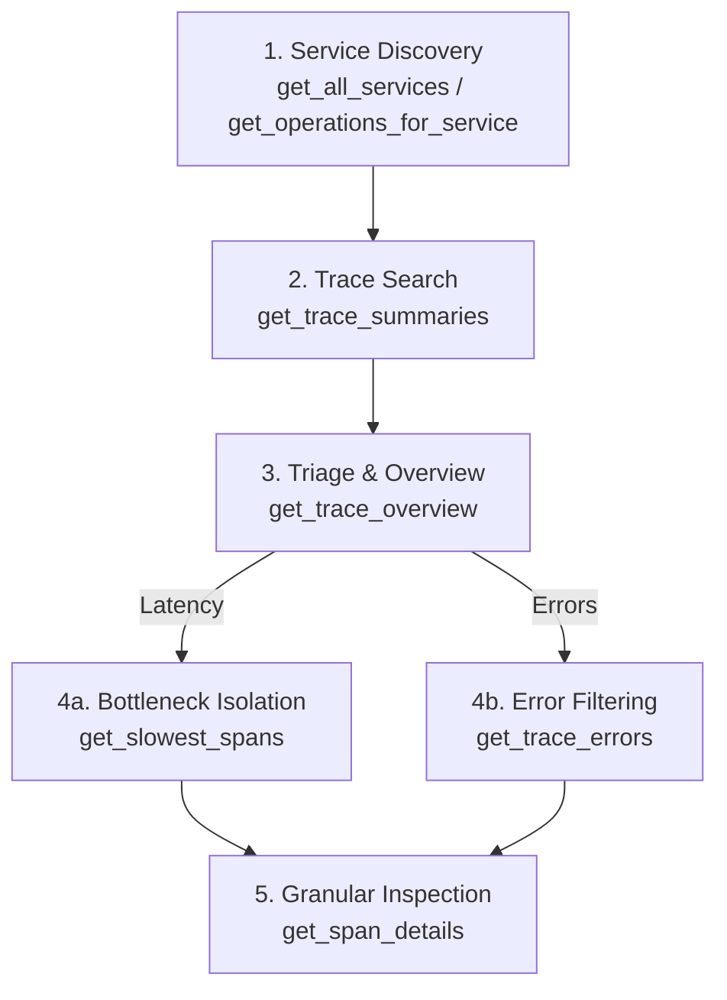

# ⚡ Jaeger MCP Server

Distributed tracing MCP server that connects AI assistants (Claude Desktop, Cursor, Antigravity, OpenCode) to **Jaeger**. It uses a progressive 5-stage funnel to investigate services, traces, bottlenecks, and errors without overloading LLM context windows with multi-megabyte raw JSON dumps.



---

## 🚀 Quickstart

### 1. Install

```bash
# Clone and enter repo
git clone https://github.com/your-username/jaeger-mcp.git
cd jaeger-mcp

# Setup environment
cp example.env .env

# Install dependencies with uv (or: pip install -e .)
uv sync
```

### 2. Run Local Jaeger & HotROD Demo (Optional)

```bash
# 1. Start Jaeger UI + OTLP collector (Port 16686 UI, 4318 OTLP HTTP)
docker run --rm --name jaeger \
  -p 16686:16686 \
  -p 4317:4317 \
  -p 4318:4318 \
  -p 5778:5778 \
  -p 9411:9411 \
  cr.jaegertracing.io/jaegertracing/jaeger:2.22.0

# 2. Run HotROD sample app connected to Jaeger
docker run --rm -it --name hotrod \
  -p 8080:8080 \
  --link jaeger:jaeger \
  -e OTEL_EXPORTER_OTLP_ENDPOINT="http://jaeger:4318" \
  cr.jaegertracing.io/jaegertracing/example-hotrod:2.22.0 all
```

- **Jaeger UI**: [http://localhost:16686](http://localhost:16686)
- **HotROD Demo UI**: [http://localhost:8080](http://localhost:8080) (click buttons to generate sample traces)

---

## 🛠️ Tool Usage Examples & Outputs

### 1. `ping_jaeger`
Check connectivity to the Jaeger query service.

- **Parameters:** `ping_url: str = "http://localhost:16686"`
- **Example Call:** `ping_jaeger()`
- **Output:**
```text
jaeger accessible on http://localhost:16686
```

---

### 2. `get_all_services`
List all instrumented microservices currently reporting to Jaeger.

- **Parameters:** `ping_url: str = "http://localhost:16686"`
- **Example Call:** `get_all_services()`
- **Output:**
```json
{
  "services": [
    "customer",
    "driver",
    "frontend",
    "jaeger",
    "mysql",
    "redis-manual",
    "route"
  ]
}
```

---

### 3. `get_operations_for_service`
Retrieve all operations and span kinds for a service.

- **Parameters:** `service_name: str`, `ping_url: str = "http://localhost:16686"`
- **Example Call:** `get_operations_for_service(service_name="driver")`
- **Output:**
```json
{
  "operations": [
    {
      "name": "driver.DriverService/FindNearest",
      "spanKind": "server"
    }
  ]
}
```

---

### 4. `get_trace_summaries`
Query high-level summaries for recent traces within a time window (defaults to last 1 hour).

- **Parameters:** `service_name: str`, `start_time_min?: str`, `start_time_max?: str`, `search_depth?: int = 20`, `operation_name?: str`, `ping_url?: str`
- **Example Call:** `get_trace_summaries(service_name="driver", search_depth=1)`
- **Output:**
```json
{
  "summaries": [
    {
      "traceId": "0752f19be1bf63061958749442056b18",
      "rootServiceName": "frontend",
      "rootOperationName": "GET /dispatch",
      "minStartTimeUnixNano": "1791548491657998220",
      "maxEndTimeUnixNano": "1791548492941190177",
      "spanCount": 39,
      "services": [
        { "name": "frontend", "spanCount": 13 },
        { "name": "redis-manual", "spanCount": 13 },
        { "name": "route", "spanCount": 10 },
        { "name": "driver", "spanCount": 1 },
        { "name": "customer", "spanCount": 1 },
        { "name": "mysql", "spanCount": 1 }
      ]
    }
  ]
}
```

---

### 5. `get_trace_overview`
Calculate total wall-clock duration, error counts, and per-service time/error distribution.

- **Parameters:** `trace_id: str`, `ping_url?: str`
- **Example Call:** `get_trace_overview(trace_id="0752f19be1bf63061958749442056b18")`
- **Output:**
```json
{
  "traceId": "0752f19be1bf63061958749442056b18",
  "rootServiceName": "frontend",
  "rootOperationName": "GET /dispatch",
  "totalDurationMs": 1283.191,
  "spanCount": 39,
  "errorCount": 2,
  "hasErrors": true,
  "services": [
    { "serviceName": "frontend", "spanCount": 13, "cumulativeDurationMs": 2899.862, "errorCount": 0 },
    { "serviceName": "mysql", "spanCount": 1, "cumulativeDurationMs": 901.109, "errorCount": 0 },
    { "serviceName": "customer", "spanCount": 1, "cumulativeDurationMs": 901.223, "errorCount": 0 },
    { "serviceName": "route", "spanCount": 10, "cumulativeDurationMs": 525.791, "errorCount": 0 },
    { "serviceName": "driver", "spanCount": 1, "cumulativeDurationMs": 185.873, "errorCount": 0 },
    { "serviceName": "redis-manual", "spanCount": 13, "cumulativeDurationMs": 185.419, "errorCount": 2 }
  ]
}
```

---

### 6. `get_slowest_spans`
Isolate latency bottlenecks sorted by duration in descending order with pagination.

- **Parameters:** `trace_id: str`, `limit?: int = 10`, `offset?: int = 0`, `ping_url?: str`
- **Example Call:** `get_slowest_spans(trace_id="0752f19be1bf63061958749442056b18", limit=3)`
- **Output:**
```json
{
  "traceId": "0752f19be1bf63061958749442056b18",
  "totalSpans": 39,
  "limit": 3,
  "offset": 0,
  "hasMore": true,
  "spans": [
    {
      "spanId": "0a5a9c536f8d4c84",
      "parentSpanId": null,
      "serviceName": "frontend",
      "operationName": "GET /dispatch",
      "durationMs": 1283.191,
      "statusCode": "OK",
      "isError": false
    },
    {
      "spanId": "3b696fe3d834a2dd",
      "parentSpanId": "ba07eb94ad029741",
      "serviceName": "customer",
      "operationName": "GET /customer",
      "durationMs": 901.223,
      "statusCode": "OK",
      "isError": false
    },
    {
      "spanId": "7b4c28197a5e4033",
      "parentSpanId": "3b696fe3d834a2dd",
      "serviceName": "mysql",
      "operationName": "SQL SELECT",
      "durationMs": 901.109,
      "statusCode": "OK",
      "isError": false
    }
  ]
}
```

---

### 7. `get_trace_errors`
Filter out healthy spans and return failing spans with exception messages and error tags.

- **Parameters:** `trace_id: str`, `ping_url?: str`
- **Example Call:** `get_trace_errors(trace_id="0752f19be1bf63061958749442056b18")`
- **Output:**
```json
{
  "traceId": "0752f19be1bf63061958749442056b18",
  "totalErrors": 2,
  "errors": [
    {
      "spanId": "6b8040528892c12c",
      "serviceName": "redis-manual",
      "operationName": "GetDriver",
      "durationMs": 31.418,
      "statusCode": "ERROR",
      "statusMessage": "",
      "errorAttributes": {
        "otel.status_code": "ERROR",
        "error": true,
        "otel.status_description": "An error occurred"
      },
      "events": [
        {
          "timestamp": 1791548492624738,
          "fields": [
            { "key": "event", "value": "exception" },
            { "key": "exception.message", "value": "redis timeout" },
            { "key": "exception.type", "value": "*errors.errorString" }
          ]
        }
      ]
    }
  ]
}
```

---

### 8. `get_span_details`
Inspect raw span attributes, timestamps, logs, and child span IDs.

- **Parameters:** `trace_id: str`, `span_id: str`, `ping_url?: str`
- **Example Call:** `get_span_details(trace_id="706be6c35bb3a0d5560110c7ed4b9e91", span_id="5820db81696f3244")`
- **Output:**
```json
{
  "traceId": "706be6c35bb3a0d5560110c7ed4b9e91",
  "spanId": "5820db81696f3244",
  "parentSpanId": "79d2fd6e5f9710c1",
  "serviceName": "driver",
  "operationName": "driver.DriverService/FindNearest",
  "startTimeUnixNano": "1791548492244601000",
  "endTimeUnixNano": "1791548492485296000",
  "durationMs": 240.695,
  "statusCode": "OK",
  "statusMessage": "",
  "isError": false,
  "attributes": {
    "rpc.system.name": "grpc",
    "rpc.method": "driver.DriverService/FindNearest",
    "server.address": "127.0.0.1",
    "server.port": 8082,
    "span.kind": "server"
  },
  "events": [
    {
      "timestamp": 1791548492301553,
      "fields": [
        { "key": "event", "value": "Retrying GetDriver after error" },
        { "key": "error", "value": "redis timeout" },
        { "key": "retry_no", "value": 1 }
      ]
    },
    {
      "timestamp": 1791548492485236,
      "fields": [
        { "key": "event", "value": "Search successful" },
        { "key": "driver_count", "value": 10 }
      ]
    }
  ],
  "childSpanIds": [
    "b1faa12267c0c92d",
    "46da9189cc53c240"
  ]
}
```

---

## 🔌 Client Configurations

Replace `<PATH_TO_JAEGER_MCP>` with your absolute repository path (e.g. `C:/jaeger-mcp` on Windows or `/home/user/jaeger-mcp` on Linux/macOS).

<details open>
<summary><b>Claude Desktop</b> (<code>claude_desktop_config.json</code>)</summary>

```json
{
  "mcpServers": {
    "jaeger": {
      "command": "uv",
      "args": [
        "run",
        "--directory",
        "<PATH_TO_JAEGER_MCP>",
        "python",
        "src/jaeger-mcp/main.py"
      ],
      "env": {
        "SERVICE_API_VERSION": "v3"
      }
    }
  }
}
```
</details>

<details>
<summary><b>Cursor</b> (<code>.cursor/mcp.json</code>)</summary>

```json
{
  "mcpServers": {
    "jaeger": {
      "command": "uv",
      "args": [
        "run",
        "--directory",
        "<PATH_TO_JAEGER_MCP>",
        "python",
        "src/jaeger-mcp/main.py"
      ]
    }
  }
}
```
</details>

<details>
<summary><b>OpenCode</b> (CLI or <code>opencode.json</code>)</summary>

Via CLI:
```bash
opencode mcp add jaeger -- uv run --directory <PATH_TO_JAEGER_MCP> python src/jaeger-mcp/main.py
```

Via `opencode.json`:
```json
{
  "$schema": "https://opencode.ai/config.json",
  "mcp": {
    "jaeger": {
      "type": "local",
      "command": [
        "uv",
        "run",
        "--directory",
        "<PATH_TO_JAEGER_MCP>",
        "python",
        "src/jaeger-mcp/main.py"
      ],
      "enabled": true,
      "environment": {
        "SERVICE_API_VERSION": "v3"
      }
    }
  }
}
```
</details>

<details>
<summary><b>Antigravity / Windsurf / Cline</b></summary>

```json
{
  "mcpServers": {
    "jaeger": {
      "command": "uv",
      "args": [
        "run",
        "--directory",
        "<PATH_TO_JAEGER_MCP>",
        "python",
        "src/jaeger-mcp/main.py"
      ],
      "transport": "stdio"
    }
  }
}
```
</details>

---

## 🧪 Testing

```bash
# Test with MCP Inspector in your browser:
npx @modelcontextprotocol/inspector uv run python src/jaeger-mcp/main.py

# Lint & format:
uv run ruff check .
uv run ruff format .
```