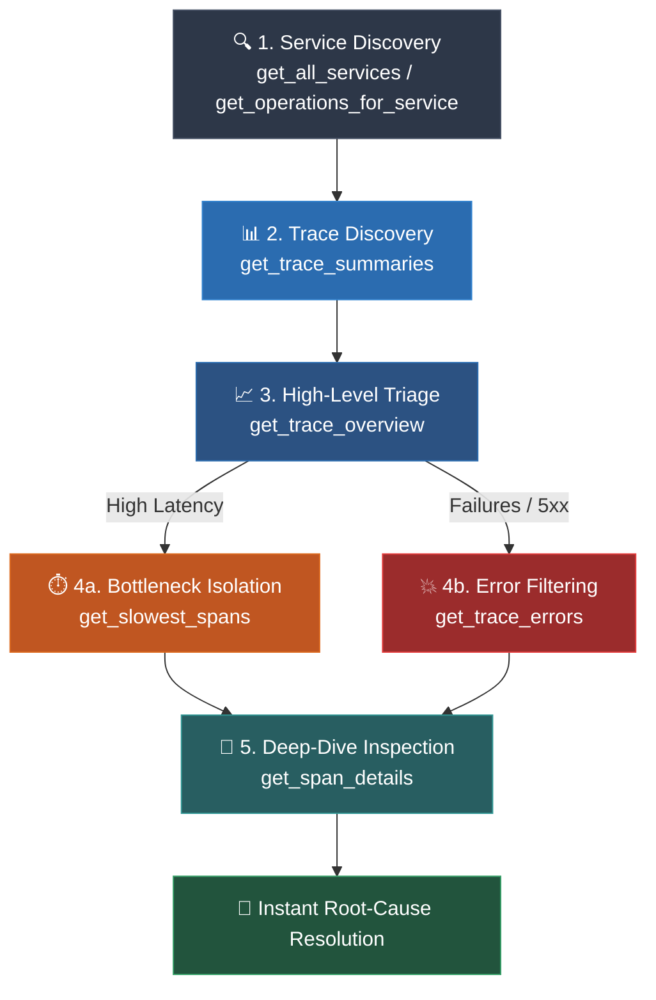

<div align="center">

# ⚡ Jaeger MCP Server

**Context-Efficient Observability & Distributed Tracing for AI Agents**

[](https://pypi.org/project/mcp-server-jaeger/)
[](https://modelcontextprotocol.io/)
[](https://python.org)
[](https://github.com/modelcontextprotocol/python-sdk)
[](https://www.jaegertracing.io/)
[](LICENSE)

*Empower LLMs and AI coding assistants (Claude Desktop, Cursor, Antigravity, OpenCode, Windsurf) to inspect microservice topologies, triage performance bottlenecks, and pinpoint root-cause errors in distributed systems without blowing up context windows.*

---

[🚀 Quickstart](#-quickstart) •
[🎯 Why Jaeger MCP?](#-why-jaeger-mcp) •
[🛠️ Tools Reference](#️-tools-reference) •
[🔌 Client Configurations](#-client-configurations) •
[🏗️ Architecture](#️-architecture) •
[🧪 Testing & Debugging](#-testing--debugging)

---

</div>

## 🎯 Why Jaeger MCP?

Distributed traces in production systems easily contain **hundreds to thousands of spans**, deep call graphs, and megabytes of JSON tags and log events.

If an AI assistant ingests an entire raw trace:
1. 💸 **Context Window Explosion:** Traces consume tens of thousands of tokens per prompt.
2. 📉 **Hallucinations & Noise:** LLMs struggle to locate relevant errors buried beneath healthy spans.
3. 🐌 **High Latency & Costs:** Huge payloads slow down response times and skyrocket API billing.

**`jaeger-mcp` solves this with a 5-Stage Progressive Discovery Funnel:**



Instead of sending 2MB raw trace blobs, the agent queries structured, paginated, and summarized slices of observability data.

---

## 🚀 Quickstart

### Prerequisites
- **Python**: `3.11` or newer
- **Package Manager**: [`uv`](https://docs.astral.sh/uv/) (recommended) or standard `pip`
- **Jaeger Instance**: Local or remote Jaeger Query service (default port `16686`)

### Installation & Run Options

#### Option 1: Instant Run with `uvx` (Recommended & Zero Setup)
```bash
uvx mcp-server-jaeger
```

#### Option 2: Install via PyPI
```bash
pip install mcp-server-jaeger
mcp-server-jaeger
```

#### Option 3: Run with Docker
```bash
docker run -i --rm --network=host -e SERVICE_API_VERSION=v3 ghcr.io/chahatsagarmain/jaeger-mcp:latest
```

#### Option 4: From Source (Development)
```bash
git clone https://github.com/chahatsagarmain/jaeger-mcp.git
cd jaeger-mcp
cp example.env .env
uv sync
uv run python -m jaeger_mcp.main
```

### 2. Spin up Local Jaeger & HotROD Demo (Optional)

```bash
# 1. Run Jaeger UI + Query API + OTLP Collector
docker run --rm --name jaeger \
  -p 16686:16686 \
  -p 4317:4317 \
  -p 4318:4318 \
  -p 5778:5778 \
  -p 9411:9411 \
  cr.jaegertracing.io/jaegertracing/jaeger:2.22.0

# 2. Run HotROD to generate realistic distributed traffic connected to Jaeger
docker run --rm -it --name hotrod \
  -p 8080:8080 \
  --link jaeger:jaeger \
  -e OTEL_EXPORTER_OTLP_ENDPOINT="http://jaeger:4318" \
  cr.jaegertracing.io/jaegertracing/example-hotrod:2.22.0 all
```

- **Jaeger UI**: [http://localhost:16686](http://localhost:16686)
- **HotROD Demo UI**: [http://localhost:8080](http://localhost:8080) (click buttons to generate traces)

---

## ⚙️ Configuration & Environment

The server reads configuration from `.env` in the project root:

| Variable | Default Value | Description |
|:---|:---:|:---|
| `SERVICE_API_VERSION` | `v3` | Jaeger Query API version for services/operations/summaries (`v3` or `v2`) |

> **Note on Jaeger URL:** Each tool accepts an optional `ping_url` argument (defaults to `http://localhost:16686`). You can target local dev instances, staging clusters, or remote production Jaeger UI proxies on the fly.

---

## 🛠️ Tools Reference

| Tool | Signature | Purpose |
|:---|:---|:---|
| [`ping_jaeger`](#1-ping_jaeger) | `ping_url: str` | Healthcheck Jaeger connectivity |
| [`get_all_services`](#2-get_all_services) | `ping_url: str` | List all instrumented microservices |
| [`get_operations_for_service`](#3-get_operations_for_service) | `service_name: str, ping_url: str` | List operations/endpoints & span kinds for a service |
| [`get_trace_summaries`](#4-get_trace_summaries) | `service_name, start_time_min?, start_time_max?, search_depth?, operation_name?, ping_url?` | Search recent traces with duration & span counts |
| [`get_trace_overview`](#5-get_trace_overview) | `trace_id: str, ping_url: str` | Wall-clock duration, error counts, and per-service breakdown |
| [`get_slowest_spans`](#6-get_slowest_spans) | `trace_id: str, limit?: int, offset?: int, ping_url: str` | Paginated bottleneck isolation sorted by duration descending |
| [`get_trace_errors`](#7-get_trace_errors) | `trace_id: str, ping_url: str` | Isolate failed spans, HTTP status codes, and exception logs |
| [`get_span_details`](#8-get_span_details) | `trace_id: str, span_id: str, ping_url: str` | Granular span inspect: attributes, logs/events, and child span IDs |

---

### Tool Outputs & Real Examples

<details open>
<summary><b>1. <code>ping_jaeger</code></b> &mdash; Connection Healthcheck</summary>

Verifies that the Jaeger HTTP endpoint is reachable.

- **Parameters:** `ping_url: str = "http://localhost:16686"`
- **Example Call:** `ping_jaeger()`
- **Actual Output:**
  ```text
  "jaeger accessible on http://localhost:16686"
  ```
</details>

<details>
<summary><b>2. <code>get_all_services</code></b> &mdash; Service Discovery</summary>

Fetches every service registered in Jaeger's registry.

- **Parameters:** `ping_url: str = "http://localhost:16686"`
- **Example Call:** `get_all_services()`
- **Actual Output:**
  ```json
  {
    "services": [
      "customer",
      "driver",
      "frontend",
      "jaeger",
      "mysql",
      "redis-manual",
      "route"
    ]
  }
  ```
</details>

<details>
<summary><b>3. <code>get_operations_for_service</code></b> &mdash; Operation Discovery</summary>

Lists all instrumented endpoints and span kinds for a specific service.

- **Parameters:** `service_name: str`, `ping_url: str = "http://localhost:16686"`
- **Example Call:** `get_operations_for_service(service_name="driver")`
- **Actual Output:**
  ```json
  {
    "operations": [
      {
        "name": "driver.DriverService/FindNearest",
        "spanKind": "server"
      }
    ]
  }
  ```
</details>

<details>
<summary><b>4. <code>get_trace_summaries</code></b> &mdash; Filtered Trace Search</summary>

Queries traces matching service, operation, and time filters (defaults to the last 1 hour).

- **Parameters:** `service_name: str`, `start_time_min?: str`, `start_time_max?: str`, `search_depth?: int = 20`, `operation_name?: str`, `ping_url?: str`
- **Example Call:** `get_trace_summaries(service_name="driver", search_depth=1)`
- **Actual Output:**
  ```json
  {
    "summaries": [
      {
        "traceId": "0752f19be1bf63061958749442056b18",
        "rootServiceName": "frontend",
        "rootOperationName": "GET /dispatch",
        "minStartTimeUnixNano": "1791548491657998220",
        "maxEndTimeUnixNano": "1791548492941190177",
        "spanCount": 39,
        "services": [
          { "name": "frontend", "spanCount": 13 },
          { "name": "redis-manual", "spanCount": 13 },
          { "name": "route", "spanCount": 10 },
          { "name": "driver", "spanCount": 1 },
          { "name": "customer", "spanCount": 1 },
          { "name": "mysql", "spanCount": 1 }
        ]
      }
    ]
  }
  ```
</details>

<details>
<summary><b>5. <code>get_trace_overview</code></b> &mdash; Wall-Clock & Service Breakdown</summary>

Computes real wall-clock duration across the entire trace distributed graph, aggregate span counts, error counts, and per-service duration/error breakdown.

- **Parameters:** `trace_id: str`, `ping_url?: str`
- **Example Call:** `get_trace_overview(trace_id="0752f19be1bf63061958749442056b18")`
- **Actual Output:**
  ```json
  {
    "traceId": "0752f19be1bf63061958749442056b18",
    "rootServiceName": "frontend",
    "rootOperationName": "GET /dispatch",
    "totalDurationMs": 1283.191,
    "spanCount": 39,
    "errorCount": 2,
    "hasErrors": true,
    "services": [
      { "serviceName": "frontend", "spanCount": 13, "cumulativeDurationMs": 2899.862, "errorCount": 0 },
      { "serviceName": "mysql", "spanCount": 1, "cumulativeDurationMs": 901.109, "errorCount": 0 },
      { "serviceName": "customer", "spanCount": 1, "cumulativeDurationMs": 901.223, "errorCount": 0 },
      { "serviceName": "route", "spanCount": 10, "cumulativeDurationMs": 525.791, "errorCount": 0 },
      { "serviceName": "driver", "spanCount": 1, "cumulativeDurationMs": 185.873, "errorCount": 0 },
      { "serviceName": "redis-manual", "spanCount": 13, "cumulativeDurationMs": 185.419, "errorCount": 2 }
    ]
  }
  ```
</details>

<details>
<summary><b>6. <code>get_slowest_spans</code></b> &mdash; Latency Bottleneck Isolation</summary>

Sorts spans across the trace by duration descending with pagination to immediately isolate the slowest operations.

- **Parameters:** `trace_id: str`, `limit?: int = 10`, `offset?: int = 0`, `ping_url?: str`
- **Example Call:** `get_slowest_spans(trace_id="0752f19be1bf63061958749442056b18", limit=3)`
- **Actual Output:**
  ```json
  {
    "traceId": "0752f19be1bf63061958749442056b18",
    "totalSpans": 39,
    "limit": 3,
    "offset": 0,
    "hasMore": true,
    "spans": [
      {
        "spanId": "0a5a9c536f8d4c84",
        "parentSpanId": null,
        "serviceName": "frontend",
        "operationName": "GET /dispatch",
        "durationMs": 1283.191,
        "statusCode": "OK",
        "isError": false
      },
      {
        "spanId": "3b696fe3d834a2dd",
        "parentSpanId": "ba07eb94ad029741",
        "serviceName": "customer",
        "operationName": "GET /customer",
        "durationMs": 901.223,
        "statusCode": "OK",
        "isError": false
      },
      {
        "spanId": "7b4c28197a5e4033",
        "parentSpanId": "3b696fe3d834a2dd",
        "serviceName": "mysql",
        "operationName": "SQL SELECT",
        "durationMs": 901.109,
        "statusCode": "OK",
        "isError": false
      }
    ]
  }
  ```
</details>

<details>
<summary><b>7. <code>get_trace_errors</code></b> &mdash; Error & Exception Filtering</summary>

Filters out healthy spans and returns only failing spans with associated exception events, HTTP error statuses, and relevant error attributes.

- **Parameters:** `trace_id: str`, `ping_url?: str`
- **Example Call:** `get_trace_errors(trace_id="0752f19be1bf63061958749442056b18")`
- **Actual Output:**
  ```json
  {
    "traceId": "0752f19be1bf63061958749442056b18",
    "totalErrors": 2,
    "errors": [
      {
        "spanId": "6b8040528892c12c",
        "serviceName": "redis-manual",
        "operationName": "GetDriver",
        "durationMs": 31.418,
        "statusCode": "ERROR",
        "statusMessage": "",
        "errorAttributes": {
          "otel.status_code": "ERROR",
          "error": true,
          "otel.status_description": "An error occurred"
        },
        "events": [
          {
            "timestamp": 1791548492624738,
            "fields": [
              { "key": "event", "value": "exception" },
              { "key": "exception.message", "value": "redis timeout" },
              { "key": "exception.type", "value": "*errors.errorString" }
            ]
          }
        ]
      }
    ]
  }
  ```
</details>

<details>
<summary><b>8. <code>get_span_details</code></b> &mdash; Granular Span Inspection</summary>

Returns complete metadata for a single span, including raw tags/attributes, timing nanoseconds, event logs, and all direct child span IDs.

- **Parameters:** `trace_id: str`, `span_id: str`, `ping_url?: str`
- **Example Call:** `get_span_details(trace_id="706be6c35bb3a0d5560110c7ed4b9e91", span_id="5820db81696f3244")`
- **Actual Output:**
  ```json
  {
    "traceId": "706be6c35bb3a0d5560110c7ed4b9e91",
    "spanId": "5820db81696f3244",
    "parentSpanId": "79d2fd6e5f9710c1",
    "serviceName": "driver",
    "operationName": "driver.DriverService/FindNearest",
    "startTimeUnixNano": "1791548492244601000",
    "endTimeUnixNano": "1791548492485296000",
    "durationMs": 240.695,
    "statusCode": "OK",
    "statusMessage": "",
    "isError": false,
    "attributes": {
      "rpc.system.name": "grpc",
      "rpc.method": "driver.DriverService/FindNearest",
      "server.address": "127.0.0.1",
      "server.port": 8082,
      "span.kind": "server"
    },
    "events": [
      {
        "timestamp": 1791548492301553,
        "fields": [
          { "key": "event", "value": "Retrying GetDriver after error" },
          { "key": "error", "value": "redis timeout" },
          { "key": "retry_no", "value": 1 }
        ]
      },
      {
        "timestamp": 1791548492485236,
        "fields": [
          { "key": "event", "value": "Search successful" },
          { "key": "driver_count", "value": 10 }
        ]
      }
    ],
    "childSpanIds": [
      "b1faa12267c0c92d",
      "46da9189cc53c240"
    ]
  }
  ```
</details>

---

## 🔌 Client Configurations

Add `jaeger-mcp` to your favorite AI assistant or IDE in seconds:

> 💡 **Path Placeholder:** In the configurations below, replace `<PATH_TO_JAEGER_MCP>` with the absolute path to your cloned repository:
> - **Windows:** `"C:\\path\\to\\jaeger-mcp"` (or `"C:/path/to/jaeger-mcp"`)
> - **macOS / Linux:** `"/Users/username/jaeger-mcp"` or `"/home/username/jaeger-mcp"`

<details open>
<summary><b>Claude Desktop</b> (<code>claude_desktop_config.json</code>)</summary>

- **Windows**: `%APPDATA%\Claude\claude_desktop_config.json`
- **macOS**: `~/Library/Application Support/Claude/claude_desktop_config.json`

```json
{
  "mcpServers": {
    "jaeger": {
      "command": "uvx",
      "args": ["mcp-server-jaeger"],
      "env": {
        "SERVICE_API_VERSION": "v3"
      }
    }
  }
}
```

*Or for local source development:*
```json
{
  "mcpServers": {
    "jaeger": {
      "command": "uv",
      "args": [
        "run",
        "--directory",
        "<PATH_TO_JAEGER_MCP>",
        "python",
        "src/jaeger_mcp/main.py"
      ],
      "env": {
        "SERVICE_API_VERSION": "v3"
      }
    }
  }
}
```
</details>

<details>
<summary><b>Cursor</b> (<code>.cursor/mcp.json</code>)</summary>

```json
{
  "mcpServers": {
    "jaeger": {
      "command": "uvx",
      "args": ["mcp-server-jaeger"]
    }
  }
}
```

*Or for local source development:*
```json
{
  "mcpServers": {
    "jaeger": {
      "command": "uv",
      "args": [
        "run",
        "--directory",
        "<PATH_TO_JAEGER_MCP>",
        "python",
        "src/jaeger_mcp/main.py"
      ]
    }
  }
}
```
</details>

<details>
<summary><b>OpenCode</b> (CLI or <code>opencode.json</code>)</summary>

**Via CLI command:**
```bash
# Via published package:
opencode mcp add jaeger -- uvx mcp-server-jaeger

# Or from local source:
opencode mcp add jaeger -- uv run --directory <PATH_TO_JAEGER_MCP> python src/jaeger_mcp/main.py
```

**Via `opencode.json`:**
```json
{
  "$schema": "https://opencode.ai/config.json",
  "mcp": {
    "jaeger": {
      "type": "local",
      "command": ["uvx", "mcp-server-jaeger"],
      "enabled": true,
      "environment": {
        "SERVICE_API_VERSION": "v3"
      }
    }
  }
}
```
</details>

<details>
<summary><b>Antigravity / Windsurf / Cline / Roo Code</b></summary>

```json
{
  "mcpServers": {
    "jaeger": {
      "command": "uvx",
      "args": ["mcp-server-jaeger"],
      "transport": "stdio"
    }
  }
}
```
</details>

<details>
<summary><b>Using standard Python / virtualenv instead of <code>uv</code></b></summary>

```json
{
  "mcpServers": {
    "jaeger": {
      "command": "<PATH_TO_JAEGER_MCP>/.venv/bin/python",
      "args": [
        "<PATH_TO_JAEGER_MCP>/src/jaeger_mcp/main.py"
      ],
      "env": {
        "SERVICE_API_VERSION": "v3"
      }
    }
  }
}
```
*(On Windows, replace with `<PATH_TO_JAEGER_MCP>\\.venv\\Scripts\\python.exe`)*
</details>

---

## 🏗️ Architecture

```
jaeger-mcp/
├── src/
│   └── jaeger_mcp/
│       ├── main.py              # MCPServer initialization & tool registration
│       ├── tools/
│       │   └── tools.py         # MCP tool handlers & default parameters
│       ├── helper/
│       │   └── tool_helper.py   # Jaeger REST client, metrics calculation & parsing logic
│       ├── schemas/
│       │   ├── services.py      # Pydantic v2 schemas for service and operation models
│       │   └── traces.py        # Pydantic v2 schemas for traces, overviews, spans & errors
├── .agents/
│   └── mcp_config.json          # Workspace-level AGY / agent configuration
├── pyproject.toml               # Project metadata & dependencies
├── uv.lock                      # Deterministic dependency lockfile
├── example.env                  # Template environment variables
├── .env                         # Local runtime environment file
└── README.md                    # Project documentation
```

### Architectural Highlights
- **Stdio Transport**: Ultra-lightweight, native process communication conforming to MCP specifications.
- **Pydantic v2 Output Validation**: Strict typing guarantees that LLM tool outputs are validated and structured.
- **Accurate Wall-Clock Math**: `get_trace_overview` calculates real root-to-leaf span times rather than naive sums of overlapping parallel spans.
- **Heuristic Error Extraction**: Filters error tags (`error=true`, `http.status_code >= 400`, `rpc.status_code != 0`) and automatically isolates associated stack traces and log events.

---

## 🧪 Testing & Debugging

```bash
# 1. Interactive testing in browser with official MCP Inspector:
npx @modelcontextprotocol/inspector uv run python -m jaeger_mcp.main

# 2. Sanity check package & tool loading:
uv run python -c "import jaeger_mcp; from jaeger_mcp.main import mcp; print(f'Jaeger MCP loaded cleanly with {len(mcp._tool_manager._tools)} tools!')"

# 3. Format and lint with ruff:
uvx ruff check .
uvx ruff format .
```

---

## ❓ Troubleshooting

<details>
<summary><b>"cannot connect to jaeger on http://localhost:16686"</b></summary>

1. Ensure Jaeger is running (`docker ps | grep jaeger`).
2. If Jaeger runs in Docker or on a remote VM, verify that port `16686` is mapped and exposed.
3. Test using `curl http://localhost:16686` in your terminal.
4. Pass custom URLs in tool calls: `ping_jaeger(ping_url="http://my-internal-jaeger:16686")`.
</details>

<details>
<summary><b>"404 Not Found on /api/v3/services"</b></summary>

Older Jaeger instances (v1.x without v3 API support) may use `v2`. Update your `.env` file:
```env
SERVICE_API_VERSION=v2
```
Or verify the API endpoints supported by your Jaeger deployment.
</details>

<details>
<summary><b>LLM says "Tool execution timed out"</b></summary>

For huge traces (10,000+ spans), fetching raw trace JSON can take time.
- Use `get_trace_summaries` first to isolate small, specific traces.
- Use `get_slowest_spans` with pagination (`limit=10, offset=0`) instead of dumping the whole trace.
</details>

---

<div align="center">
  <sub>Built with ❤️ for observability engineers and AI-assisted DevOps workflows.</sub>
</div>